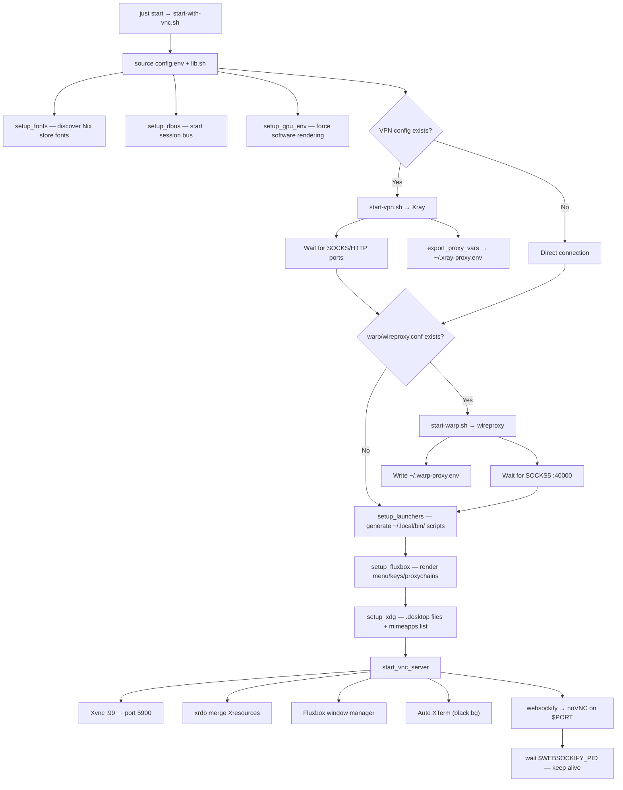

# Architecture Overview

A **Firebase Studio template** that presents itself as a Flutter project creator but actually bootstraps a full **Linux VNC desktop** (Fluxbox + Chromium + optional Camoufox/Antigravity + Xterm) with optional Xray VPN and Cloudflare WARP — all running inside a browser tab via noVNC.

---

## High-Level Architecture

```
┌─────────────────────────────────────────────────────────────────────┐
│                     Firebase Studio (Cloud VM)                      │
│                                                                     │
│  ┌──────────────┐    ┌──────────────┐    ┌───────────────────────┐ │
│  │ idx-template  │    │  idx-template │    │  .idx/dev.nix         │ │
│  │   .json       │───▶│    .nix       │───▶│  (generated from      │ │
│  │ (UI params)   │    │ (bootstrap)   │    │   devNix.j2)          │ │
│  └──────────────┘    └──────────────┘    └───────────────────────┘ │
│                                                    │                │
│                            ┌───────────────────────┘                │
│                            ▼                                        │
│  ┌─────────────────────────────────────────────────────────────┐   │
│  │              start-with-vnc.sh (orchestrator)                │   │
│  │                                                              │   │
│  │  ┌───────────┐ ┌──────────┐ ┌────────────┐ ┌─────────────┐ │   │
│  │  │ Xvnc :99  │ │ Fluxbox  │ │ websockify │ │ Xray VPN    │ │   │
│  │  │ (X server)│ │ (WM)     │ │ (noVNC)    │ │ (optional)  │ │   │
│  │  └─────┬─────┘ └────┬─────┘ └──────┬─────┘ └──────┬──────┘ │   │
│  │        │             │              │               │        │   │
│  │        └──────┬──────┘              │        ┌──────┴──────┐ │   │
│  │               ▼                     │        │ wireproxy   │ │   │
│  │  ┌──────────────────────┐           │        │ WARP VPN    │ │   │
│  │  │  Desktop Apps        │           │        │ (optional)  │ │   │
│  │  │  • Chromium          │◀──proxy───┘        └──────┬──────┘ │   │
│  │  │  • Camoufox (opt)    │◀──────────proxy───────────┘        │   │
│  │  │  • Antigravity (opt) │                                    │   │
│  │  │  • XTerm             │                                    │   │
│  │  └──────────────────────┘                                    │   │
│  └─────────────────────────────────────────────────────────────┘   │
│                            │                                        │
│                            ▼                                        │
│               Firebase Studio Preview Panel                         │
│              (noVNC web client in iframe)                            │
└─────────────────────────────────────────────────────────────────────┘
```

---

## Repository Structure

```
anti-flutter-template/
├── idx-template.json          # Firebase Studio UI — fake Flutter params
├── idx-template.nix           # Bootstrap — copies VNC env into $out
├── devNix.j2                  # Jinja2 template → generates .idx/dev.nix
├── flake.nix                  # Runtime Nix flake — builds browser wrappers
├── README.md                  # User-facing readme
├── ARCHITECTURE.md            # This file
├── TEMPLATE-GUIDE.md          # Step-by-step walkthrough
├── explore.md                 # Dev notes
│
├── camoufox/                  # Anti-detect browser sub-flake (optional)
│   ├── flake.nix              # Standalone flake (imported by root flake)
│   ├── package.nix            # Nix derivation: fetch, patch, wrap Camoufox
│   ├── browser-1.sh           # Wrapper template for profile #1
│   ├── browser-2.sh           # Wrapper template for profile #2
│   └── README.md
│
└── out/                       # Files copied verbatim into the workspace
    ├── config.env             # All ports, paths, flags — single source of truth
    ├── lib.sh                 # Shared bash helpers (logging, process, proxy, template)
    ├── justfile               # Task runner (start/stop/status/vpn/warp)
    │
    ├── start-with-vnc.sh      # Main orchestrator — launches everything
    ├── start-vpn.sh           # Xray VPN launcher
    ├── stop-vnc.sh            # Graceful shutdown of all services
    ├── stop-vpn.sh            # Xray-only shutdown
    ├── status-vnc.sh          # Prints process/VPN/WARP/port status
    │
    ├── scripts/               # Modular setup functions (sourced, not exec'd)
    │   ├── setup-fonts.sh     # Discovers Nix store fonts, writes fontconfig
    │   ├── setup-dbus.sh      # Starts session DBus daemon
    │   ├── setup-gpu-env.sh   # Forces software rendering (no GPU)
    │   ├── setup-launchers.sh # Generates ~/.local/bin/ browser scripts
    │   ├── setup-fluxbox.sh   # Renders menu/keys/proxychains from templates
    │   ├── setup-xdg.sh       # Sets default browser via .desktop + mimeapps
    │   ├── start-vnc-server.sh# Launches Xvnc, Fluxbox, XTerm, websockify
    │   └── start-warp.sh      # WARP VPN management (setup/start/stop/status)
    │
    ├── wrappers/
    │   └── google-chrome.sh   # Nix replaceVars template (proxy-aware)
    │
    ├── config/
    │   ├── Xresources                    # XTerm color scheme + font + keybinds
    │   ├── proxychains.conf.template     # proxychains-ng → Xray SOCKS5
    │   ├── proxychains-warp.conf.template# proxychains-ng → WARP SOCKS5
    │   └── fluxbox/
    │       ├── init                      # Fluxbox workspace settings
    │       ├── startup                   # Fluxbox autostart (xsetroot + exec)
    │       ├── menu.template             # Right-click menu with {{placeholders}}
    │       └── keys.template             # Keyboard shortcuts with {{placeholders}}
    │
    ├── v2ray-client.json.example         # VMess VPN config template
    └── v2ray-client-reality.json.example # VLESS Reality VPN config template
```

> **Note:** `out/.idx/dev.nix` no longer exists as a static file. It is **generated at bootstrap time** from `devNix.j2` via `j2cli`, with content varying based on template parameters.

---

## Two-Phase Nix Architecture

The project uses Nix in **two distinct phases** with different purposes:

### Phase 1: Bootstrap (`idx-template.nix`)

Runs **once** when the workspace is created. Produces the `$out` directory.

| Aspect | Detail |
|--------|--------|
| **When** | Workspace creation only |
| **Channel** | `unstable` |
| **Packages** | `curl`, `git`, `busybox`, `j2cli`, `nixfmt` |
| **Conditional** | `chromium` (always), `camoufoxPkg` (if `camoufox=true`), `pkgsUnfree.antigravity` (if `antigravity=true`), `wgcf`+`wireproxy` (if `warp=true`) |
| **Action** | Copies `out/` → `$out`, copies `flake.nix` + `camoufox/`, symlinks binaries, renders `devNix.j2` → `.idx/dev.nix`, sets up WARP config |

### Phase 1b: Template Rendering (`devNix.j2`)

`idx-template.nix` generates `$out/.idx/dev.nix` from a **Jinja2 template** using `j2cli`:

```bash
warp=${if warp then "true" else "false"} j2 devNix.j2 -o "$out"/.idx/dev.nix
nixfmt "$out"/.idx/dev.nix
```

The template conditionally includes:
- **WARP packages** (`pkgs.wgcf`, `pkgs.wireproxy`) — only when `warp=true`
- **`onStart.startWarp`** hook — only when `warp=true`, auto-starts wireproxy on workspace boot

This follows the same pattern as the official Astro template's `devNix.j2`.

### Phase 2: Runtime (`dev.nix` + `flake.nix`)

Runs **every time** the workspace starts.

| File | Purpose |
|------|---------|
| `.idx/dev.nix` (generated) | Firebase Studio environment: installs TigerVNC, Fluxbox, noVNC, Xray, fonts, etc. Configures the web preview to run `start-with-vnc.sh`. Conditionally includes WARP packages and onStart hook. |
| `flake.nix` | Builds a `vnc-browser-env` package via `nix build`. Creates Chromium/Camoufox wrapper scripts with proxy detection and hardcoded flags using `replaceVars` |

---

## Optional Components

Three components are controlled by `idx-template.json` boolean parameters:

| Component | Parameter | Default | Bootstrap Effect | Runtime Effect |
|-----------|-----------|---------|------------------|----------------|
| **Camoufox** | `camoufox` | `false` | Builds from `camoufox/package.nix`, copies sub-flake, symlinks binaries | Launchers auto-detect via `_find_bin`; skipped if binary absent |
| **Antigravity** | `antigravity` | `false` | Imports `pkgsUnfree` with `allowUnfree=true`, symlinks binary | Launchers auto-detect via `_find_bin`; skipped if binary absent |
| **WARP VPN** | `warp` | `false` | Symlinks `wgcf`+`wireproxy`, registers WARP account, generates `wireproxy.conf`, injects packages + `onStart` hook into `dev.nix` | `start-with-vnc.sh` detects `warp/wireproxy.conf` and starts wireproxy; dedicated browser launchers + menu entries |

When a component is disabled, its Nix derivation is **never evaluated** (saves build time), no binaries are symlinked, and runtime scripts gracefully skip it.

---

## Component Details

### VNC Display Stack

```
Xvnc :99 (5900)  →  Fluxbox (window manager)  →  websockify (5999)  →  noVNC (browser)
```

- **Xvnc** — Headless X server with built-in VNC, 1920×1080@24bit, no auth
- **Fluxbox** — Lightweight WM with 4 workspaces (Main, Web, Term, Misc)
- **websockify** — Bridges VNC protocol to WebSocket for noVNC
- **noVNC** — Cloned at first boot from GitHub; serves the web VNC client

Port assignment is UID-based to avoid collisions in multi-user environments:
```
DISPLAY_NUM = UID % 100 + 10
VNC_PORT    = 5900 + DISPLAY_NUM
NOVNC_PORT  = 6000 + DISPLAY_NUM  (overridden by Firebase $PORT)
```

### Browser Wrappers

Three browser types (Camoufox and Antigravity optional), each with direct, Xray-proxy, and WARP-proxy variants:

| Browser | Direct | Xray VPN (🔒) | WARP (🌐) | Notes |
|---------|--------|---------------|-----------|-------|
| **Chromium** | `browser` | `browser-proxy` | `browser-warp` | Always available. `--no-sandbox`, `--jitless`, Ozone/X11 flags |
| **Camoufox** | `camoufox-browser-{1,2}` | `camoufox-proxy` | `camoufox-warp` | Optional. Anti-detect Firefox fork; separate profiles |
| **Antigravity** | `antigravity` | `antigravity-proxy` | `antigravity-warp` | Optional (unfree). Proxy via proxychains4 |

All launchers live in `~/.local/bin/`. The `flake.nix` creates an additional set of wrappers (`google-chrome`, `chromium`, `xdg-open`) via `replaceVars` that auto-detect `$PROXY_SOCKS5` at launch time.

### Dual Proxy Architecture

Two independent proxy backends can coexist simultaneously:

```
┌─────────────────────────────────────────┐
│  Xray VPN (user's V2Ray server)         │
│  SOCKS5 → 127.0.0.1:10808              │
│  HTTP   → 127.0.0.1:10809              │
│  Config: v2ray-client*.json             │
│  Env:    ~/.xray-proxy.env              │
│  Chain:  ~/.proxychains.conf            │
├─────────────────────────────────────────┤
│  WARP VPN (Cloudflare wireproxy)        │
│  SOCKS5 → 127.0.0.1:40000              │
│  Config: warp/wireproxy.conf            │
│  Env:    ~/.warp-proxy.env              │
│  Chain:  ~/.proxychains-warp.conf       │
└─────────────────────────────────────────┘
```

Each proxy has its own:
- Dedicated browser launcher variants (`*-proxy` vs `*-warp`)
- Separate `proxychains` config file
- Fluxbox menu section
- Start/stop/status commands
- PID file and log file

### VPN (Xray) Integration

```
Xray (xray run -config ...)
  ├── SOCKS5 inbound → 127.0.0.1:10808
  └── HTTP   inbound → 127.0.0.1:10809
        │
        ├──→ Browser --proxy-server=socks5://...
        ├──→ proxychains4 -f ~/.proxychains.conf (for Antigravity)
        └──→ Shell: source ~/.xray-proxy.env
```

**Routing rules** bypass the proxy for:
- Localhost / private IPs
- VNC ports (5900, 5999)
- The workstation's own `cloudworkstations.dev` domain

Supports two Xray protocols:
- **VMess** (WebSocket) — `v2ray-client.json`
- **VLESS Reality** (TCP/TLS) — `v2ray-client-reality.json`

### WARP VPN (wireproxy) Integration

```
wireproxy (WireGuard userspace client)
  └── SOCKS5 → 127.0.0.1:40000
        │
        ├──→ Browser --proxy-server=socks5://127.0.0.1:40000
        ├──→ proxychains4 -f ~/.proxychains-warp.conf (for Antigravity)
        └──→ Shell: source ~/.warp-proxy.env
```

**Bootstrap** (runs once at workspace creation when `warp=true`):
1. `wgcf register --accept-tos` — registers a free Cloudflare WARP account
2. `wgcf generate` — generates WireGuard profile
3. Appends `[Socks5] BindAddress = 127.0.0.1:40000` to create `wireproxy.conf`

**Runtime** (via `start-warp.sh`):
1. Launches `wireproxy -c warp/wireproxy.conf` in background
2. Waits for SOCKS5 port 40000
3. Tests connectivity through the proxy
4. Writes `~/.warp-proxy.env`

WARP requires no user configuration — it's fully automatic.

### Template Rendering System

Two template systems are used:

**1. Jinja2 (`devNix.j2`)** — renders `dev.nix` at bootstrap time via `j2cli`. Uses `` conditionals for WARP-specific packages and hooks.

**2. `render_template()` in `lib.sh`** — replaces `{{KEY}}` placeholders at runtime:

```
config/fluxbox/menu.template         →  ~/.fluxbox/menu
config/fluxbox/keys.template         →  ~/.fluxbox/keys
config/proxychains.conf.template     →  ~/.proxychains.conf
config/proxychains-warp.conf.template→  ~/.proxychains-warp.conf
```

This allows menu entries and keyboard shortcuts to reference dynamically-resolved binary paths and port numbers.

---

## Startup Sequence



---

## Service Management

| Command | Script | Action |
|---------|--------|--------|
| `just start` | `start-with-vnc.sh` | Full boot: VPN → WARP → Desktop → VNC |
| `just stop` | `stop-vnc.sh` | Graceful shutdown of all PIDs (including wireproxy) + cleanup |
| `just status` | `status-vnc.sh` | Process check, VPN test, WARP test, URL display |
| `just vpn` | `start-vpn.sh` | Start Xray VPN only |
| `just vpn-stop` | `stop-vpn.sh` | Stop Xray + clear proxy env |
| `just warp` | `scripts/start-warp.sh` | Start WARP VPN (setup + start) |
| `just warp-stop` | `scripts/start-warp.sh stop` | Stop wireproxy + clear WARP env |

PID tracking: all process IDs (including `WIREPROXY_PID`) are written to `~/.antigravity-vnc.pid` for reliable cleanup.

---

## Keyboard Shortcuts (Fluxbox)

| Shortcut | Action |
|----------|--------|
| `Ctrl+Alt+T` | Open XTerm |
| `Ctrl+Alt+B` | Open Chromium |
| `Ctrl+Alt+1` | Open Camoufox (Profile 1) |
| `Ctrl+Alt+2` | Open Camoufox (Profile 2) |
| `Alt+Tab` | Next window |
| `Alt+F4` | Close window |
| `Alt+F10` | Maximize |
| `Super+Left/Right` | Snap window to half screen |

---

## Security & Environment Notes

- **`host.virtualization = true`** in `idx-template.json` requests a VM-backed workspace (needed for Xvnc)
- **GPU disabled** — all rendering is software-based (Mesa llvmpipe / swrast)
- **Chromium flags** — `--no-sandbox`, `--jitless`, `--disable-gpu` for headless VM compatibility
- **Camoufox** — ELF interpreters are patched via `patchelf`; anti-detection policies are relaxed to restore search engines
- **`allowUnfree = true`** — only imported when `antigravity=true` (avoids unfree overlay when not needed)
- **WARP account** — registered automatically at bootstrap (free tier, no credentials required)
