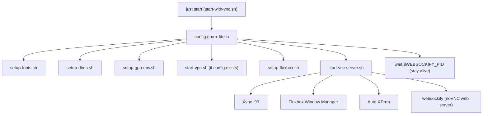

# Architecture Overview

A **Linux VNC workspace** running a full VNC desktop (Fluxbox + Chromium + Camoufox + Xterm + optional Xray VPN).

## Startup Flow

## Core Infrastructure

**Key config (`config.env`):**
| Variable | Default | Purpose |
|----------|---------|---------|
| `DISPLAY_NUM` | `99` | X display number |
| `VNC_PORT` | `5900` | Xvnc listen port |
| `NOVNC_PORT` | `5999` | noVNC websocket port |
| `SOCKS_PORT` | `10808` | Xray SOCKS5 proxy |
| `HTTP_PORT` | `10809` | Xray HTTP proxy |

**Fluxbox config is generated at runtime** in `setup-fluxbox.sh` (using `config/fluxbox` templates and heredocs). This populates application shortcuts in menus with the correct dynamically resolved browser wrappers.

**`flake.nix` builds:**
- A controlled shell path with needed binaries.
- Configures Chrome and Camoufox wrappers to properly consume Proxy variables (detecting `$PROXY_SOCKS5`) when the VPN is active.
- Imports `camoufox` from a local folder sub-flake.

## VPN Setup

Running with a VPN creates an isolating environment. To try it:
1. `cp v2ray-client.json.example v2ray-client.json`
2. Configure settings inside the JSON.
3. Restart VNC using `just start`.
