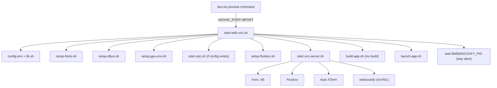

# Codebase Overview

An **Antigravity VNC workspace** with a built-in **Project IDX Flutter template**. Runs a full VNC desktop (Fluxbox + Chromium + optional VPN) inside Firebase Studio, with a Dart-only Flutter project bootstrapper.

## Startup Flow



## Directory Structure

```
anti-flutter-template/
│
├── .idx/dev.nix              ← THIS workspace's config (antigravity, tigervnc, fluxbox)
├── dev.nix                   ← TEMPLATE runtime (copied into generated Flutter projects)
│
├── config.env                ← Shared config: ports, paths, PID files, VPN settings
├── lib.sh                    ← Shared utils: logging, process mgmt, proxy, render_template
├── flake.nix                 ← Nix flake: wraps antigravity + chromium + camoufox
├── justfile                  ← Task runner: just start / stop / status
│
├── start-with-vnc.sh         ← Main orchestrator (sources all scripts, runs sequence)
├── start-vpn.sh              ← Xray VPN proxy start (standalone)
├── stop-vnc.sh               ← Stop all services (app, VNC, fluxbox, dbus, xray)
├── stop-vpn.sh               ← Stop Xray only
├── status-vnc.sh             ← Status check for all services + VPN connectivity test
│
├── scripts/
│   ├── setup-fonts.sh        ← Font config via nix-build (fallback if nix-build fails)
│   ├── setup-dbus.sh         ← DBus session daemon
│   ├── setup-gpu-env.sh      ← Disable GPU/Vulkan (software rendering)
│   ├── setup-fluxbox.sh      ← Generate menu, keys, init via heredocs (not templates)
│   ├── start-vnc-server.sh   ← Xvnc + Fluxbox + auto XTerm + websockify
│   ├── build-app.sh          ← nix build + chromium/camoufox symlink setup
│   ├── launch-app.sh         ← DISPLAY=:99 ./result/bin/antigravity
│   └── update.dart           ← Code-gen: regenerates idx-template.json from Flutter samples
│
├── config/
│   ├── Xresources            ← XTerm theme (dark, DejaVu Sans Mono, VS Code colors)
│   ├── proxychains.conf.template
│   └── fluxbox/
│       ├── init              ← Fluxbox session config (toolbar, workspaces, alpha)
│       ├── keys.template     ← Keyboard shortcuts (kept as reference, not used at runtime)
│       ├── menu.template     ← Menu structure (kept as reference, not used at runtime)
│       └── startup           ← Fluxbox startup script (xsetroot + xterm)
│
├── wrappers/
│   └── google-chrome.sh      ← Proxy-aware Chromium wrapper
├── camoufox/
│   ├── flake.nix             ← External Camoufox package flake (used via root flake input)
│   ├── browser-1.sh          ← Camoufox launcher (profile-1)
│   ├── browser-2.sh          ← Camoufox launcher (profile-2)
│   └── README.md             ← Camoufox launcher notes
│
├── v2ray-client.json.example         ← VMess + WebSocket VPN template
├── v2ray-client-reality.json.example ← VLESS + Reality VPN template
│
├── idx-template.json         ← Template UI definition (6 params, ~500 samples)
├── idx-template.nix          ← Bootstrap: flutter create + copy all infra files
├── Makefile                  ← make update → regenerate idx-template.json
├── README.md
└── explore.md                ← This file
```

## Two Systems, One Repo

### 1. Antigravity VNC Infrastructure

The main system. Launches a full VNC desktop accessible via noVNC in the browser.

**Key config (`config.env`):**
| Variable | Default | Purpose |
|----------|---------|---------|
| `DISPLAY_NUM` | `99` | X display number |
| `VNC_PORT` | `5900` | Xvnc listen port |
| `NOVNC_PORT` | `5999` | noVNC websocket port (IDX overrides via `$PORT`) |
| `SOCKS_PORT` | `10808` | Xray SOCKS5 proxy |
| `HTTP_PORT` | `10809` | Xray HTTP proxy |
| `BROWSER_CMD` | `~/.local/bin/browser` | Symlink to built Chromium |
| `CAMOUFOX_BROWSER1_CMD` | `~/.local/bin/camoufox-browser-1` | Camoufox launcher (profile-1) |
| `CAMOUFOX_BROWSER2_CMD` | `~/.local/bin/camoufox-browser-2` | Camoufox launcher (profile-2) |
| `APP_PATTERN` | `bin/antigravity` | Process pattern for pkill/pgrep |

All ports use `${VAR:-default}` so IDX can override them (e.g. `NOVNC_PORT=$PORT`).

**`lib.sh` functions:**
- `log_info/success/warn/error` — colored logging
- `check_process` / `kill_by_pattern` / `kill_by_pid` — process management
- `write_proxy_env` / `export_proxy_vars` / `clear_proxy_vars` — proxy setup
- `wait_for_port` — poll TCP port with timeout
- `test_vpn_connection` — compare real vs VPN IP
- `render_template` — sed-based `{{KEY}}` replacement (uses `|` delimiter)

**Fluxbox config is generated at runtime** via bash heredocs in `setup-fluxbox.sh` (not from template files). This ensures proper variable expansion of `$TERMINAL_BIN`, `$BROWSER_CMD`, `$CAMOUFOX_BROWSER1_CMD`, and `$CAMOUFOX_BROWSER2_CMD`.

**`flake.nix` builds:**
- Wraps `pkgs.antigravity` with a controlled PATH
- Uses external input `camoufox.url = "path:./camoufox"`
- Follows root nixpkgs for the external input (`camoufox.inputs.nixpkgs.follows = "nixpkgs"`)
- Creates `google-chrome` wrapper that auto-detects VPN proxy (`$PROXY_SOCKS5`)
- Imports Camoufox package from `camoufox.packages.${system}.camoufox`
- Installs `camoufox-browser-1` and `camoufox-browser-2` wrappers with isolated profiles
- Creates `xdg-open` wrapper pointing to same Chromium
- Disables GPU/Vulkan via env vars

### 2. Flutter Template (IDX)

Bootstraps new Flutter projects with all Antigravity infrastructure baked in.

```
idx-template.json → idx-template.nix → flutter create + copy all infra files
```

**Template params (`idx-template.json`):**

| Param | Type | Purpose |
|-------|------|---------|
| `template` | enum | `app`, `module`, `package`, `plugin`, `plugin_ffi`, `skeleton` |
| `sample` | enum | ~500+ Flutter widget samples (or "None") |
| `blank` | boolean | Skip boilerplate comments (`-e` flag) |
| `platforms` | text | Default: `web` |
| `org` | text | Organization (e.g. `com.example`) |
| `project-name` | text | Project name |

**`idx-template.nix` copies into every generated project:**
1. Root `dev.nix` → `$out/.idx/dev.nix` (Dart-only runtime)
2. All shell scripts (`start-with-vnc.sh`, `stop-vnc.sh`, etc.)
3. `config.env`, `lib.sh`, `flake.nix`, `justfile`
4. `scripts/` directory (all 7 setup/launch scripts)
5. `config/` directory (Xresources, fluxbox, proxychains)
6. `wrappers/` directory
7. `camoufox/` directory
8. VPN config examples

### Two `dev.nix` Files

| File | Purpose |
|------|---------|
| `.idx/dev.nix` | **This workspace** — installs tigervnc, fluxbox, antigravity (no preview command) |
| `dev.nix` (root) | **Template runtime** — copied into generated projects, full package list + preview command |

The root `dev.nix` contains the preview command that launches the VNC environment:
```nix
command = ["bash" "-c" "NOVNC_PORT=$PORT ./start-with-vnc.sh"];
manager = "web";
```

## VPN Setup

Optional. To enable:
1. Copy `v2ray-client.json.example` → `v2ray-client.json`
2. Fill in server address, UUID, and other connection details
3. Restart — `start-with-vnc.sh` auto-detects the config

Two protocols supported:
- **VMess + WebSocket** (`v2ray-client.json`)
- **VLESS + Reality** (`v2ray-client-reality.json`)

When active, all proxy env vars are exported and the Chromium wrapper auto-routes through SOCKS5.

Fluxbox browser access now includes:
- Chromium (`Ctrl+Alt+B`)
- Camoufox profile 1 (`Ctrl+Alt+1`)
- Camoufox profile 2 (`Ctrl+Alt+2`)

## Code-Gen

```bash
make update    # runs: dart scripts/update.dart
```
Fetches Flutter's sample registry and regenerates the ~500 sample entries in `idx-template.json`.
